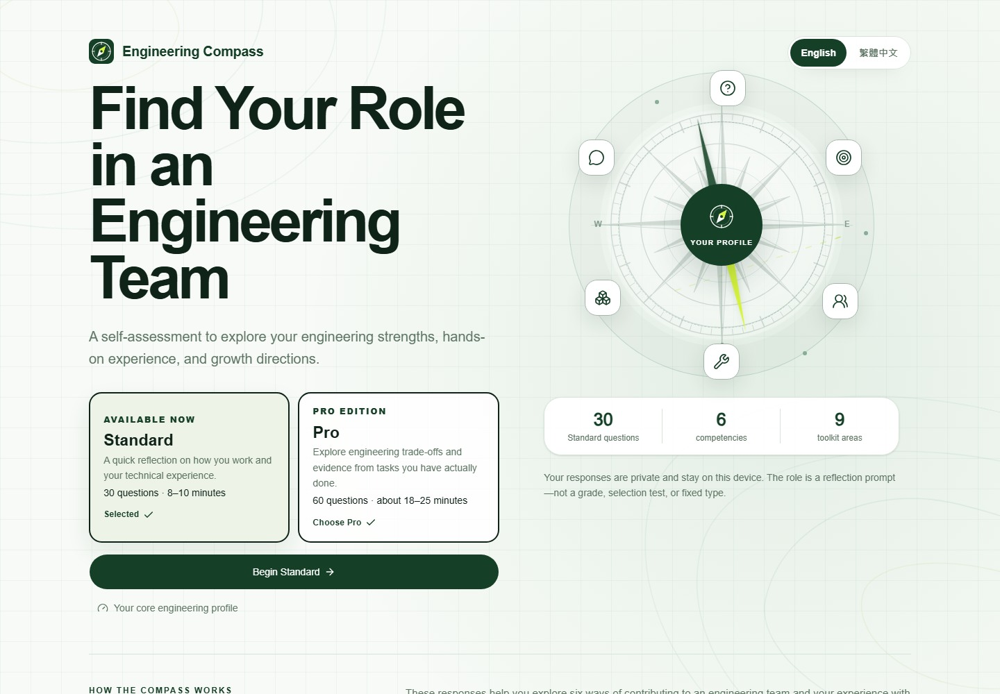
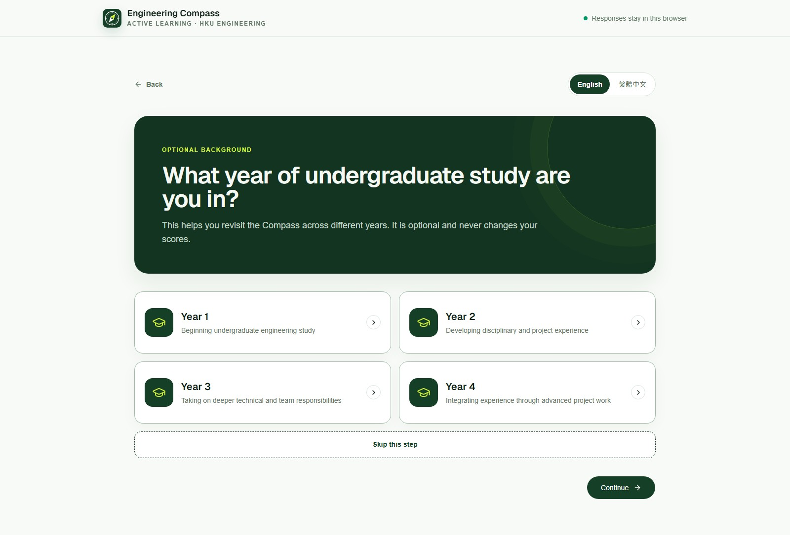
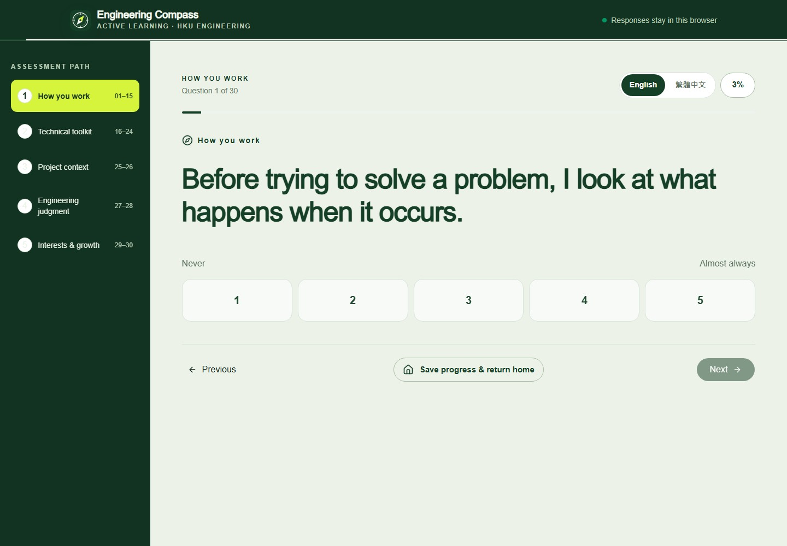
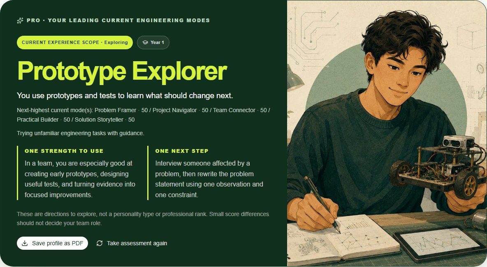
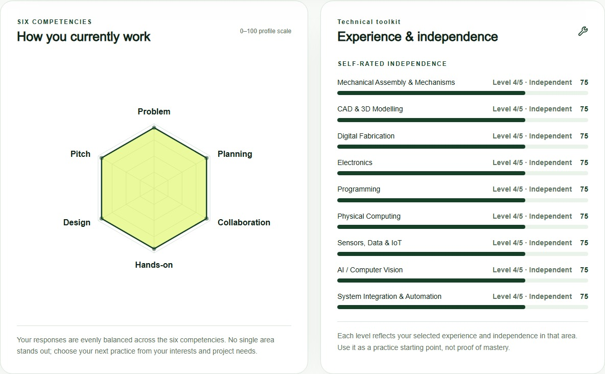

# Engineering Compass · 工程羅盤

Explore how you work, what you have practised, and what you want to develop next.

Engineering Compass is a bilingual self-reflection tool for engineering learners, from first-year students to experienced project teams. It brings together six competencies, nine technical experience areas, and practical next steps in a personal profile.

**[Open Engineering Compass →](https://active-learning-kyle.github.io/engineering-compass/)** · [Browse the source](https://github.com/Active-Learning-Kyle/engineering-compass)

English / 繁體中文 · No account required · Responses stay in your browser · Full results PDF



## Start here

1. Choose **Standard** or **Pro**.
2. Select your undergraduate year, or skip this optional step.
3. Answer one question at a time. Go back, switch language, or resume saved progress in the same browser.
4. Explore your current strengths, technical experience, and chosen growth directions.
5. Select **Save profile as PDF** to download the complete results as a paginated report.

The questions use plain language. You do not need formal engineering project or presentation experience to answer the behavioural items.

Answer choices without a natural sequence are shuffled once for each attempt to reduce order bias. Ordered scales and experience levels stay in their meaningful sequence, and **Other / not sure yet** stays last. The chosen order is saved with unfinished progress, so it does not move when you resume.

Answer tiles appear after a brief pause. If several answers are entered unusually quickly, a reminder lets the learner either review the current answer or keep it and continue.

## Standard or Pro?

|                       | Standard                                                         | Pro                                                                            |
| --------------------- | ---------------------------------------------------------------- | ------------------------------------------------------------------------------ |
| Purpose               | A quick reflection on how you work and your technical experience | A deeper reflection on decisions and experience from specific tasks            |
| Questions             | 30                                                               | 60                                                                             |
| Typical time          | 8–10 minutes                                                     | About 18–25 minutes                                                            |
| Core profile          | Six competencies + nine technical areas                          | The same core profile                                                          |
| Additional reflection | Two engineering-judgment scenarios                               | Also includes 12 team-decision trade-offs and 18 practice-evidence items       |
| Results               | Current modes, experience scope, strengths, and next steps       | All Standard results, plus decision feedback and practice-evidence reflections |

**Pro adds context, not extra points.** Its additional questions do not change the Standard core scores. Team decisions offer two defensible approaches with different benefits and costs, rather than a textbook “best answer.”

## A look inside

### A starting point, not a prerequisite

Study year is optional and never changes your scores.



### One question at a time

Behaviour questions use a five-point frequency scale. Technical questions use a separate experience and independence scale. Language switching preserves your answers.



### Your current profile

The summary connects a leading current mode with experience scope and a next step. Exact displayed-score ties can produce joint modes; equal scores across all six dimensions produce a balanced profile.



### Behaviour and technical experience, side by side

The radar shows six competencies. The Technical Toolkit shows nine separate self-ratings. Pro practice evidence adds context underneath; it is not averaged into the toolkit score.



_These screenshots use synthetic example responses, not student data. Your results depend on your own answers._

## Meet the six engineering roles

These are **current ways of contributing**, not fixed personality types or assigned team positions. Each role connects to one competency; the illustrations are visual representations, not part of scoring.

<table>
<tr>
<td width="33%" valign="top">
<br>
<strong>Problem Framer</strong><br>
Understand what is happening before choosing what to solve.<br><br>
<em>Problem Identification</em>
</td>
<td width="33%" valign="top">
<br>
<strong>Project Navigator</strong><br>
Turn an idea into a practical plan with steps, priorities, and dependencies.<br><br>
<em>Proposal with Plan</em>
</td>
<td width="33%" valign="top">
<br>
<strong>Team Connector</strong><br>
Help people with different skills coordinate their work and understand each other.<br><br>
<em>Interdisciplinary Collaboration</em>
</td>
</tr>
<tr>
<td width="33%" valign="top">
<br>
<strong>Practical Builder</strong><br>
Bring practical technical experience to building, testing, and troubleshooting.<br><br>
<em>Hands-on Skills</em>
</td>
<td width="33%" valign="top">
<br>
<strong>Prototype Explorer</strong><br>
Try ideas in a simple form, learn from tests, and improve what you make.<br><br>
<em>Design Thinking &amp; Prototyping</em>
</td>
<td width="33%" valign="top">
<br>
<strong>Solution Storyteller</strong><br>
Explain an idea clearly, including its value, evidence, and limitations.<br><br>
<em>Pitch for Engineering Solutions</em>
</td>
</tr>
</table>

## What the results mean

- **Six competencies:** self-reported ways of working, not an objective ability test.
- **Technical Toolkit:** experience and independence across mechanical assembly, CAD, digital fabrication, electronics, programming, physical computing, sensors/data/IoT, AI/computer vision, and system integration.
- **Current Experience Scope:** Exploring, Building, Practising, or Integrating. An approximate summary of reported projects, responsibilities, and technical experience—not a qualification or seniority level.
- **Practice evidence (Pro):** tasks you report doing, not independently verified evidence or additional ability points.
- **Growth directions:** actions to consider for your next learning task or project.

Engineering Compass supports formative reflection. It is **not a validated assessment**, grade, professional certification, or tool for ranking students. Small score differences should not determine team roles.

### How scores work

Five competencies each use the mean of three behavioural responses. Hands-on Skills uses the mean of the nine Technical Toolkit responses. Each toolkit area also retains its own rating.

```text
Profile score = round(((mean response - 1) / 4) × 100)
```

Study year, interests, growth choices, and judgment scenarios do not change the radar scores. Project count and responsibility inform the separate experience-scope heuristic, not the competency scores. See [scoring](lib/assessment/scoring.ts), [role and scope interpretation](lib/assessment/profile.ts), and [Pro interpretation](lib/assessment/pro.ts) for implementation details.

## Privacy and saving

- Answers and unfinished progress remain in local browser storage; the app does not submit them to a server.
- There is no account, class dashboard, or student ranking system.
- Saved progress is tied to that browser and device. Clearing browser storage can remove it.
- PDF generation happens in your browser. It includes the complete results, including Pro reflections when applicable, and uses a fixed-width layout with a side-by-side summary card on phones and desktops.
- The PDF contains your profile information. Share it only if you want others to see it.

The site is delivered through GitHub Pages; “browser-only responses” describes assessment answers, not the hosting provider's ordinary handling of website requests.

## For developers

Built with React, TypeScript, vinext/Vite, Tailwind CSS, Recharts, and Lucide icons. PDF export uses html-to-image and jsPDF. The deployed application is a static site.

### Run locally

Use **Node.js 24**.

```bash
npm ci
npm run dev
```

### Check and build

```bash
npm test
npm run lint
npx tsc --noEmit
npm run build
```

Static output is written to `dist/client`. The [GitHub Pages workflow](.github/workflows/deploy.yml) checks and deploys pushes to `main`.

### Where to find things

| Location                                               | Contents                                                                  |
| ------------------------------------------------------ | ------------------------------------------------------------------------- |
| [app/page.tsx](app/page.tsx)                           | Home, study-year step, assessment flow, and results                       |
| [app/globals.css](app/globals.css)                     | Visual system, responsive layouts, and export styling                     |
| [lib/assessment](lib/assessment)                       | Questions, scoring, interpretation, saved drafts, and PDF export          |
| [lib/i18n](lib/i18n)                                   | English and Traditional Chinese messages with stable translation keys     |
| [public/modes](public/modes)                           | Six role illustrations, each with two character variants                  |
| [tests/assessment.test.mjs](tests/assessment.test.mjs) | Question, language, scoring, interpretation, and export regression checks |
| [docs](docs)                                           | Design notes and assessment development history                           |

The current question sets are **Standard v1.8 / Pro v0.4**. Older documents mentioning a Pro pilot describe development history; the current interface presents Standard and Pro. Revisions that change question meanings are versioned so older drafts are not silently reinterpreted. Passing software tests does not establish assessment validity.

## Licence and permitted use

The software code is available under the [MIT License](LICENSE). The assessment questions, interpretations, written content, Engineering Compass name and branding, screenshots, and role illustrations are not covered by that software licence; they remain all rights reserved unless a file states otherwise. See [CONTENT-NOTICE.md](CONTENT-NOTICE.md) before reusing the assessment or its visual assets.
